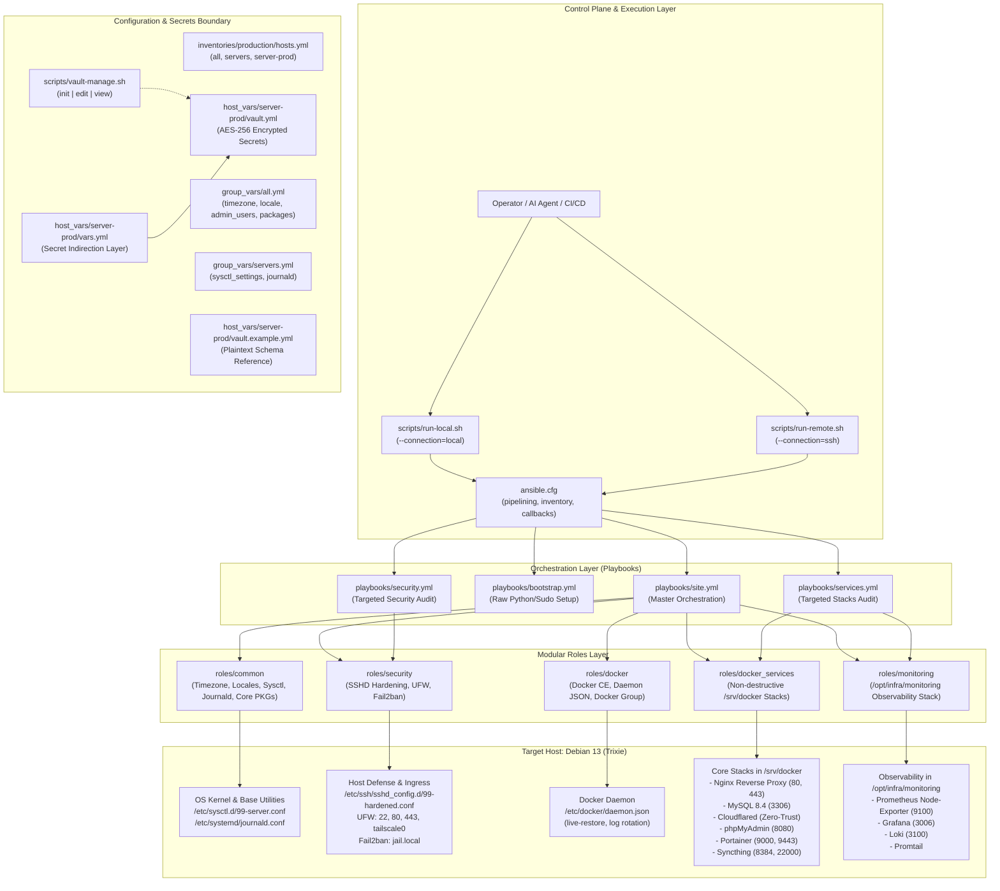

# System Architecture & Codebase Mapping Guide

- **Target System:** Debian GNU/Linux 13 (Trixie)
- **Automation Framework:** Ansible (Core 2.19+)
- **Repository Root:** `/home/admin/ansible-infra`
- **Specification:** [`docs/superpowers/specs/2026-09-13-ansible-infra-architecture-design.md`](file:///home/admin/ansible-infra/docs/superpowers/specs/2026-09-13-ansible-infra-architecture-design.md)
- **Implementation Plan:** [`docs/superpowers/plans/2026-09-13-ansible-infra-setup.md`](file:///home/admin/ansible-infra/docs/superpowers/plans/2026-09-13-ansible-infra-setup.md)

---

## 1. High-Level Subsystem Architecture

The infrastructure automation is designed around a decoupled, modular role architecture that manages both host operating system baselines and containerized microservice stacks. It supports a dual execution model: local execution on the host itself (`ansible_connection: local`) and remote execution over SSH (`ansible_connection: ssh`) from developer workstations or CI/CD runners.

### Subsystem Architecture Diagram



---

## 2. Inventory Hierarchy & Variable Precedence Tree

Ansible evaluates variables using a 22-level precedence hierarchy. In this repository, the variable hierarchy is deliberately streamlined into six distinct scopes to maintain predictability, prevent shadowing bugs, and enforce a strict boundary between public code and private credentials.

### 2.1 Variable Precedence Matrix (Lowest to Highest)

| Level | Scope / Source Location | Description & Usage in this Codebase | Override Rules |
|---|---|---|---|
| **1 (Lowest)** | `roles/<role>/defaults/main.yml` | Base defaults provided by each role (e.g. `docker_log_max_size: 50m`, `security_ssh_port: 22`). | Easily overridden by group or host variables. |
| **2** | `inventories/production/group_vars/all.yml` | Global variables applied across the entire inventory (e.g. `timezone`, `system_locale`, `admin_users`, `common_packages`). | Overrides role defaults; overridden by child group vars. |
| **3** | `inventories/production/group_vars/servers.yml` | Variables specific to the `servers` group (e.g. `sysctl_settings`, `journald_max_use`). | Overrides `all.yml`; overridden by host vars. |
| **4** | `inventories/production/host_vars/<host>/vars.yml` | Host-specific configurations and secret indirection mappings (e.g. `mysql_root_password: "{{ vault_mysql_root_password }}"`). | Overrides group vars; committed safely to git. |
| **5** | `inventories/production/host_vars/<host>/vault.yml` | AES-256 encrypted raw secrets prefixed with `vault_`. | Encrypted at rest; decrypted into inventory host scope. |
| **6 (Highest)** | Extra Variables (`-e "key=val"`) | Command-line runtime overrides passed to `ansible-playbook`. | Overrides all inventory and role settings. |

### 2.2 Variable Resolution Flow

```text
+-------------------------------------------------------------+
| 1. Role Defaults (roles/*/defaults/main.yml)                |
|    e.g., common_timezone: "{{ timezone | default(...) }}"   |
+------------------------------+------------------------------+
                               |
                               v
+-------------------------------------------------------------+
| 2. Global Group Vars (group_vars/all.yml)                   |
|    e.g., timezone: "Asia/Jakarta"                           |
+------------------------------+------------------------------+
                               |
                               v
+-------------------------------------------------------------+
| 3. Server Group Vars (group_vars/servers.yml)               |
|    e.g., sysctl_settings: { vm.max_map_count: 262144 }     |
+------------------------------+------------------------------+
                               |
                               v
+-------------------------------------------------------------+
| 4. Host Vars (host_vars/server-prod/vars.yml)               |
|    e.g., mysql_root_password: "{{ vault_mysql_root_password | default(...) }}" |
+------------------------------+------------------------------+
                               |
                               v
+-------------------------------------------------------------+
| 5. Vault Secrets (host_vars/server-prod/vault.yml)          |
|    e.g., vault_mysql_root_password: "<encrypted string>"   |
+------------------------------+------------------------------+
                               |
                               v
+-------------------------------------------------------------+
| 6. Extra Vars (-e ansible_host=... -e ansible_connection=ssh) |
|    e.g., used by scripts/run-remote.sh                      |
+-------------------------------------------------------------+
```

### 2.3 Variable Indirection Pattern

To allow role tasks and playbooks to execute during syntax verification or dry-runs without requiring the live vault key, sensitive variables use an **indirection pattern with fallback filters**:

```yaml
# In host_vars/server-prod/vars.yml:
mysql_root_password: "{{ vault_mysql_root_password | default('CHANGE_ME_IN_VAULT') }}"
cloudflared_token: "{{ vault_cloudflared_token | default('') }}"
grafana_admin_password: "{{ vault_grafana_admin_password | default('admin') }}"
syncthing_gui_password: "{{ vault_syncthing_gui_password | default('') }}"
```

Role tasks reference `mysql_root_password` directly rather than accessing `vault_*` variables, keeping roles decoupled from specific secret backend providers.

---

## 3. Role Decomposition & Tag Reference

The repository decomposes server management into five self-contained roles located under `roles/`.

### 3.1 Role Directory Structure & Responsibilities

#### 1. `roles/common`
- **Purpose:** System baseline standardization, kernel parameters, and systemd journal retention.
- **Key Variables (`defaults/main.yml`):**
  - `common_timezone`: Timezone string (default: `"{{ timezone | default('Asia/Jakarta') }}"`).
  - `common_locale`: Locale code (default: `"{{ system_locale | default('en_US.UTF-8') }}"`).
  - `common_packages_list`: List of essential utilities (`curl`, `git`, `htop`, `jq`, `unzip`, `ca-certificates`, `gnupg`, `software-properties-common`, `rsync`, `tree`).
  - `common_sysctl`: Map of sysctl tuning options (`vm.max_map_count: 262144`, `fs.file-max: 2097152`, `net.core.somaxconn: 65535`).
  - `common_journald_limit`: Maximum journal space (default: `"500M"`).
- **Handlers:**
  - `Reload sysctl`: Runs `sysctl --system`.
  - `Restart systemd-journald`: Restarts `systemd-journald` service.
- **Files Modified on Target:**
  - `/etc/sysctl.d/99-server.conf`
  - `/etc/systemd/journald.conf`

#### 2. `roles/security`
- **Purpose:** Host-level hardening, perimeter firewalling, and brute-force prevention without severing active administrative access.
- **Key Variables (`defaults/main.yml`):**
  - `security_ssh_port`: SSH listening port (`22`).
  - `security_ssh_permit_root`: `"prohibit-password"` (disallows password auth for root).
  - `security_ssh_max_auth_tries`: `5`.
  - `security_ssh_permit_empty_passwords`: `"no"`.
  - `security_ufw_default_incoming`: `"deny"`.
  - `security_ufw_default_outgoing`: `"allow"`.
  - `security_ufw_allowed_ports`: Whitelist entries for ports `22` (SSH), `80` (HTTP), and `443` (HTTPS).
  - `security_ufw_allowed_interfaces`: Interface whitelist (`tailscale0`).
  - `security_fail2ban_bantime`: `"1h"`.
  - `security_fail2ban_findtime`: `"10m"`.
  - `security_fail2ban_maxretry`: `5`.
- **Handlers:**
  - `Restart ssh`: Restarts `ssh` daemon.
  - `Reload ufw`: Reloads UFW firewall state.
  - `Restart fail2ban`: Restarts `fail2ban` service.
- **Files Modified on Target:**
  - `/etc/ssh/sshd_config.d/99-hardened.conf` (via template `99-hardened.conf.j2`)
  - `/etc/fail2ban/jail.local` (via template `jail.local.j2`)

#### 3. `roles/docker`
- **Purpose:** Docker Community Edition (CE) repository management, runtime configuration, and group privileges.
- **Key Variables (`defaults/main.yml`):**
  - `docker_apt_arch`: Architecture string (`"amd64"`).
  - `docker_apt_repository`: Official Debian Docker repository line.
  - `docker_packages`: `docker-ce`, `docker-ce-cli`, `containerd.io`, `docker-buildx-plugin`, `docker-compose-plugin`.
  - `docker_users`: List of users added to `docker` group (`"{{ admin_users }}"`).
  - `docker_log_max_size`: Maximum JSON log size before rotation (`"50m"`).
  - `docker_log_max_file`: Maximum log rotations retained (`"3"`).
  - `docker_live_restore`: Enables container survival during daemon restarts (`true`).
- **Handlers:**
  - `Restart docker`: Restarts `docker` daemon.
- **Files Modified on Target:**
  - `/etc/apt/keyrings/docker.asc`
  - `/etc/apt/sources.list.d/docker.list`
  - `/etc/docker/daemon.json` (via template `daemon.json.j2`)

#### 4. `roles/docker_services`
- **Purpose:** Non-destructive lifecycle orchestration of core Docker stacks in `/srv/docker`.
- **Key Variables (`defaults/main.yml`):**
  - `docker_services_base_dir`: Base directory (`"/srv/docker"`).
  - `docker_services_stacks`: List of stacks (`nginx`, `mysql`, `cloudflared`, `phpmyadmin`, `portainer`, `syncthing`).
- **Adoption Mechanics:**
  - Pre-flight step performs `stat` on each stack directory.
  - If the directory exists, executes `docker compose up -d --remove-orphans`.
  - Change detection tracks `Started`, `Created`, or `Recreated` stdout keywords to ensure idempotence.
  - Gathers and displays active container status (`docker ps`).
- **Handlers:**
  - `Reload global-nginx`: Executes `docker exec global-nginx nginx -s reload`.

#### 5. `roles/monitoring`
- **Purpose:** Lifecycle management and health verification of the observability stack in `/opt/infra/monitoring`.
- **Key Variables (`defaults/main.yml`):**
  - `monitoring_dir`: Base directory (`"/opt/infra/monitoring"`).
  - `monitoring_grafana_port`: HTTP port for Grafana (`3006`).
  - `monitoring_loki_port`: HTTP port for Loki (`3100`).
- **Components Managed:**
  - Prometheus `node-exporter` (port 9100)
  - Loki (port 3100)
  - Promtail
  - Grafana (port 3006)
- **Handlers:**
  - `Restart monitoring stack`: Executes `docker compose restart` in `monitoring_dir`.
- **Health Verification:**
  - Invokes `ansible.builtin.uri` against `http://127.0.0.1:3006/api/health` with automatic retries.

---

### 3.2 Master Playbook Execution Flow (`playbooks/site.yml`)

The master playbook executes in two sequential plays to ensure proper fact gathering and runtime availability:

```text
PLAY 1: "Infrastructure Master Orchestration: Base System & Security"
  ├── Gather Facts: true
  ├── Role: common          [tags: common, base]
  └── Role: security        [tags: security]

PLAY 2: "Infrastructure Master Orchestration: Docker Runtime & Stacks"
  ├── Gather Facts: false
  ├── Role: docker          [tags: docker]
  ├── Role: docker_services [tags: docker_services, services]
  └── Role: monitoring      [tags: monitoring]
```

### 3.3 Tag Taxonomy & Selective Execution Matrix

Tags allow operators and automation agents to execute targeted subsets of the infrastructure without running the entire playbook:

| Tag Name | Target Roles / Tasks | Common Operational Use Case |
|---|---|---|
| `common` | `roles/common` | Updating system packages, kernel parameters, journal limits. |
| `base` | `roles/common` | Synonym for base system configuration. |
| `security` | `roles/security` | Updating firewall rules, rotating SSH configs, refreshing fail2ban. |
| `docker` | `roles/docker` | Upgrading Docker CE packages, reconfiguring `daemon.json`. |
| `docker_services` | `roles/docker_services` | Re-deploying or restarting `/srv/docker` application stacks. |
| `services` | `roles/docker_services` | Fast alias for container services. |
| `monitoring` | `roles/monitoring` | Refreshing Grafana, Loki, Promtail, or Node-Exporter. |

#### Operational Tag Examples:

```bash
# Run only security hardening:
ansible-playbook playbooks/site.yml --tags security

# Run all container services (apps + monitoring):
ansible-playbook playbooks/site.yml --tags "services,monitoring"

# Run everything except Docker engine installation:
ansible-playbook playbooks/site.yml --skip-tags docker
```

---

## 4. Security & Secrets Boundary Architecture

The repository adheres to strict zero-trust credential segregation to ensure that private keys, database passwords, and API tokens can never be leaked into version control.

### 4.1 Secrets Architecture Diagram

```text
+-----------------------------------------------------------------------------------+
| Version Controlled in Git                                                         |
|                                                                                   |
|  [vault.example.yml]                                                              |
|  # Plaintext schema & mock keys:                                                  |
|  vault_mysql_root_password: "ReplaceWithActualMySQLRootPassword"                  |
|  vault_cloudflared_token: "ReplaceWithCloudflareTunnelToken"                      |
|                                                                                   |
|  [vars.yml]                                                                       |
|  # Indirection mapping:                                                           |
|  mysql_root_password: "{{ vault_mysql_root_password | default('CHANGE_ME') }}"    |
+-----------------------------------------------------------------------------------+
                                          |
                         (Copied & Encrypted via AES-256)
                                          v
+-----------------------------------------------------------------------------------+
| Excluded from Git (.gitignore enforced)                                           |
|                                                                                   |
|  [.vault_pass]                                                                    |
|  # Symmetric master password used for decrypting Ansible Vault                    |
|                                                                                   |
|  [vault.yml]                                                                      |
|  # $ANSIBLE_VAULT;1.1;AES256                                                      |
|  # 31393836373735393165313936663231333464303366303233316139333939626364373461... |
+-----------------------------------------------------------------------------------+
```

### 4.2 Git Exclusion Rules (`.gitignore`)

The `.gitignore` strictly protects sensitive material:

```gitignore
*.retry
.vault_pass
*.log
.DS_Store
__pycache__/
*.pyc
inventories/production/host_vars/*/vault.yml
!inventories/production/host_vars/*/vault.example.yml
```

### 4.3 Vault Management Workflow (`scripts/vault-manage.sh`)

The repository includes a dedicated helper script for secrets lifecycle management:

```bash
# Initialize a new encrypted vault from the template:
./scripts/vault-manage.sh init

# Edit existing encrypted vault in $EDITOR:
./scripts/vault-manage.sh edit

# View decrypted contents in terminal:
./scripts/vault-manage.sh view
```

### 4.4 Defense-in-Depth Host Protection

1. **SSH Lockout Prevention & Hardening:**
   - Drop-in configuration at `/etc/ssh/sshd_config.d/99-hardened.conf` ensures base configuration remains intact.
   - `PermitRootLogin prohibit-password` permits root access strictly via authorized SSH keys, eliminating brute-force risk.
   - `MaxAuthTries 5` prevents SSH key enumeration attacks.
   - Handlers restart `ssh` only after configuration files pass syntax validation.

2. **Perimeter Firewall (UFW):**
   - Default incoming policy: `deny`.
   - Default outgoing policy: `allow`.
   - Explicit ingress ports: `22/tcp` (management), `80/tcp` (HTTP), `443/tcp` (HTTPS).
   - Trusted mesh interface: `tailscale0` is granted unrestricted ingress, allowing internal cluster traffic and monitoring scrape operations across the private mesh.

3. **Intrusion Prevention (Fail2ban):**
   - Configured via `/etc/fail2ban/jail.local`.
   - Protects SSH with a 1-hour ban time upon 5 failures detected within 10 minutes (`findtime = 10m`).

4. **Non-Destructive Container Adoption:**
   - Pre-existing persistent data volumes in `/srv/docker` (MySQL databases, Portainer data, Nginx configs) are never wiped or overwritten.
   - The `docker_services` role checks directory existence and adopts running containers via `docker compose up -d`, ensuring zero service disruption.

---

## 5. Guide for AI Agents and Human Operators

This section specifies operational protocols for AI agents and human engineers navigating, mapping, or refactoring this codebase.

### 5.1 Executing `/zoom-out` (Codebase Architecture Mapping)

When an AI agent or operator needs to map the entire repository topology, understand inter-role dependencies, or trace variable evaluation, use the following sequence:

#### Step 1: Inventory & Host Topology Inspection
Run `ansible-inventory` to visualize the host and group hierarchy:

```bash
# Graph all groups and hosts:
ansible-inventory --graph

# Output expected:
# @all:
#   |--@ungrouped:
#   |--@servers:
#   |  |--server-prod
```

#### Step 2: Variable Resolution Tracing
Inspect how Ansible compiles and resolves variables for a target host after merging all `group_vars`, `host_vars`, and defaults:

```bash
# Trace resolved variables for server-prod:
ansible-inventory --host server-prod
```

#### Step 3: Playbook & Task Pipeline Inspection
Inspect the ordered task list across all plays to understand the execution pipeline:

```bash
# List all tasks with their associated tags:
ansible-playbook --list-tasks playbooks/site.yml

# List available tags across the entire orchestration:
ansible-playbook --list-tags playbooks/site.yml
```

#### Step 4: Role Interface Mapping
When mapping an unfamiliar role, inspect its three primary interfaces in order:
1. **Interface Contract (Inputs):** `roles/<role>/defaults/main.yml` defines the public API of the role.
2. **Implementation (Tasks):** `roles/<role>/tasks/main.yml` defines the procedural tasks executed.
3. **Side Effects (Handlers):** `roles/<role>/handlers/main.yml` defines all daemon reloads or restarts triggered by task state changes.

---

### 5.2 Executing `/improve-codebase-architecture` (Refactoring & Audits)

When performing architectural audits or refactoring tasks, evaluate the codebase against these quality standards:

#### 1. Anti-Pattern Detection Checklist

| Category | Anti-Pattern Smells | Remediation Guideline |
|---|---|---|
| **Modularity** | Tasks duplicated across multiple roles (e.g. installing `curl` or Docker in both `monitoring` and `docker`). | Extract common prerequisites into `roles/common` or define reusable task includes. |
| **Hardcoding** | Raw IP addresses, hardcoded paths, or port numbers inside `tasks/main.yml`. | Move all configurable values into `defaults/main.yml` with sensible fallbacks. |
| **Idempotence** | Using `ansible.builtin.command` or `shell` without `changed_when`, `failed_when`, or `creates`. | Always specify `changed_when` or migrate to native declarative Ansible modules. |
| **Secrets Leakage** | Plaintext credentials, auth tokens, or private keys committed in playbooks or variable files. | Move secret keys to `host_vars/<host>/vault.yml` prefixed with `vault_`, add placeholder to `vault.example.yml`, and reference via `vars.yml`. |
| **Privilege Scope** | Applying `become: true` at individual task level when the entire playbook runs as root, or vice-versa. | Define privilege escalation cleanly in `ansible.cfg` or at the play level. |

#### 2. Safe Refactoring Workflow

Follow this 5-stage verification cycle for any structural refactor:

1. **Syntax Check:**
   ```bash
   ansible-playbook --syntax-check playbooks/site.yml
   ```
2. **Linter / Dry-Run (`--check --diff`):**
   ```bash
   ansible-playbook playbooks/site.yml --check --diff
   ```
   *Verify that proposed diffs match expected architectural changes.*
3. **Targeted Tag Execution:**
   Test the modified role in isolation before executing the master playbook:
   ```bash
   ansible-playbook playbooks/site.yml --tags <modified-role>
   ```
4. **Idempotence Proof:**
   Execute the playbook a second time. The output must report `changed=0 failed=0`:
   ```bash
   ansible-playbook playbooks/site.yml
   ```
5. **Runtime Health Audit:**
   Confirm system services and container workloads remain active:
   ```bash
   sudo docker ps --format "table {{.Names}}\t{{.Status}}\t{{.Ports}}"
   sudo ufw status verbose
   ```

---

## 6. Playbook Reference & Quick Commands

### Execution Scripts

| Script | Command Equivalent | Description |
|---|---|---|
| [`scripts/run-local.sh`](file:///home/admin/ansible-infra/scripts/run-local.sh) | `ansible-playbook playbooks/site.yml -i inventories/production/hosts.yml` | Executes full orchestration locally on the target server. Supports trailing flags (e.g. `--check`, `--tags security`). |
| [`scripts/run-remote.sh`](file:///home/admin/ansible-infra/scripts/run-remote.sh) | `ansible-playbook playbooks/site.yml -e ansible_host=<ip> -e ansible_connection=ssh` | Executes full orchestration remotely against a specified IP or hostname over SSH. |
| [`scripts/vault-manage.sh`](file:///home/admin/ansible-infra/scripts/vault-manage.sh) | `ansible-vault {init\|edit\|view}` | Manages encrypted credentials in `host_vars/server-prod/vault.yml`. |

### Sub-Playbooks Reference

| Playbook | Purpose | Invocation |
|---|---|---|
| [`playbooks/site.yml`](file:///home/admin/ansible-infra/playbooks/site.yml) | Master orchestration: applies all 5 roles across all layers. | `./scripts/run-local.sh` |
| [`playbooks/bootstrap.yml`](file:///home/admin/ansible-infra/playbooks/bootstrap.yml) | Bootstraps raw target nodes with Python 3, sudo, and apt prerequisites. | `ansible-playbook playbooks/bootstrap.yml` |
| [`playbooks/security.yml`](file:///home/admin/ansible-infra/playbooks/security.yml) | Targeted security audit and firewall deployment. | `ansible-playbook playbooks/security.yml` |
| [`playbooks/services.yml`](file:///home/admin/ansible-infra/playbooks/services.yml) | Targeted refresh of Docker application stacks and monitoring. | `ansible-playbook playbooks/services.yml` |
